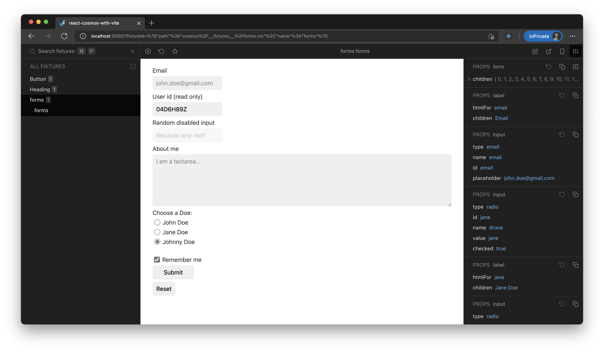

# React Cosmos with Vite

An example repo to show how to use React Cosmos with Vite.

## Getting started

Run `npm install` to prepare.

In a console, run:

```
npm run start:renderer
```

And in another console, run:

```
npm run cosmos
```

Open http://localhost:5000. You will see a Cosmos catalog!


